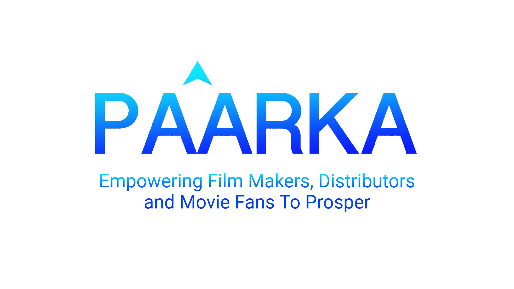
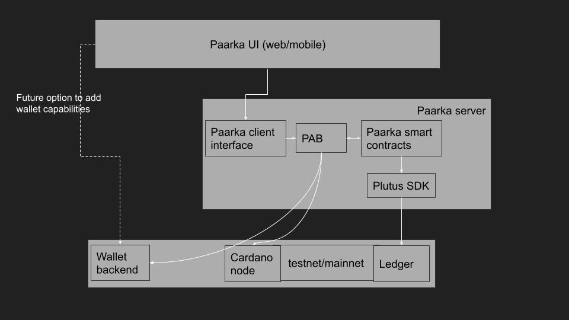

## Publish anywhere, grow everywhere

[Paarka](https://hackcardano.cardstarter.io/project/paarka/) allows content creators to publish individually unique & limited edition encrypted videos and audio files, and mint tokens to act as a license that will decrypt or unlock those media files.

Our platform allows you to grow  your community, incentivize marketing partners, share profits with customizable smart contracts, track engagement, buy, sell and trade NFT’s with several innovative adaptations for the Cardano blockchain.

### Problem
Distributors and content creators lack good solutions to market, monetize their works and are protect their digital goods from piracy. Consumers demand better streaming platforms in order to create personalized collections of movies and music with superior UX/UI.

### Solution
Digital files encrypted and licensed via NFT tokens to protect the files from piracy. The NFT tokens can be bought sold and transferred securely as well as gamified to increase engagement. Smart contract affiliate links provide a way to engage marketing partners. Decentralized marketplaces remove middlemen and allow trading of these digital assets.

### Structure visualization

[edit](https://docs.google.com/presentation/d/1-XHiG_ojCZpwFK9q5MCR0JgzcQWZYFpAgp6rBuORGXU/edit?usp=sharing)
